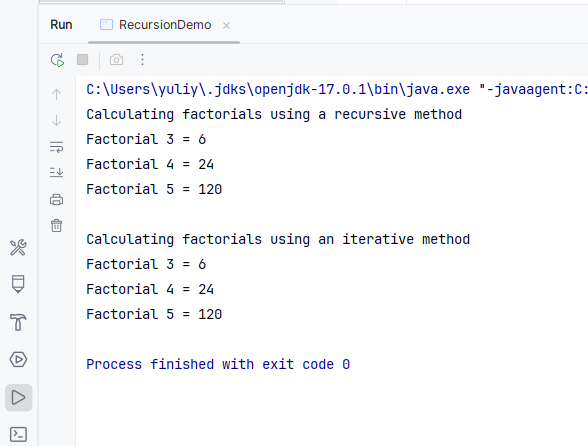

# Recursion
A simple Java program demonstrating recursive and iterative methods for calculating the factorial of a number. 

## Table of contents
1. [Description](#description)
2. [Technologies](#technologies)
3. [Installation and Launch](#installation-and-launch)
4. [Author](#author)
5. [License](#license)
6. [Usage Examples](#usage-examples)
7. [Screenshots](#screenshots)

## Description

This project is designed as an educational example to illustrate the difference between recursive and iterative approaches
in programming.

### Features

- **Recursive Method:** Calculates the factorial of a number using recursion.
- **Iterative Method:** Calculates the factorial using a loop-based approach.
- Outputs factorials for numbers 3, 4, and 5 as a demonstration.

## Technologies

- **Java**: Version 17.

## Installation and Launch
### ***Prerequisites***

To run this project, you need:
- Java Development Kit (JDK) 17 or higher installed.
- A Java IDE (IntelliJ  IDEA, Eclipse, etc.) or a text editor and command-line tools.

### Installation
  
 1. Clone the repository:
   ```bash
   git clone https://github.com/YuliyaZimenina/Recursion.git
   cd Recursion
   ```
2. Open the project in your favorite IDE (IntelliJ IDEA, Eclipse, etc.).
3. Run the application (RecursionDemo.java).

## Author

[Yuliya Zimenina](https://github.com/YuliyaZimenina)

## License

This project is distributed under the MIT license.

## Usage Examples

**RecursionDemo class:**
```java

public class RecursionDemo {
    public static void main(String[] args) {
        Factorial f = new Factorial();

        System.out.println("Calculating factorials using a recursive method");
        System.out.println("Factorial 3 = " + f.factorialRecursive(3));
        System.out.println("Factorial 4 = " + f.factorialRecursive(4));
        System.out.println("Factorial 5 = " + f.factorialRecursive(5));
        System.out.println();

        System.out.println("Calculating factorials using an iterative method");
        System.out.println("Factorial 3 = " + f.factorialIterative(3));
        System.out.println("Factorial 4 = " + f.factorialIterative(4));
        System.out.println("Factorial 5 = " + f.factorialIterative(5));
    }
}

```

## Screenshots 

Example Output:


